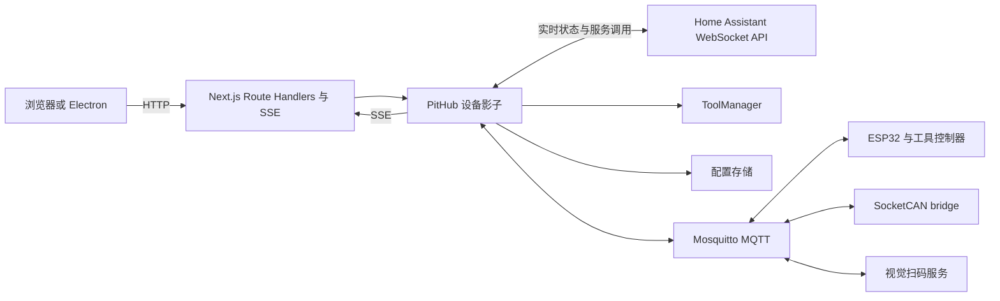

# 系统架构

## 1. 系统定位

PIT-OS 是单站点、本地优先的 FRC Pit 控制面板。Next.js 单体同时提供界面、HTTP API
和设备状态聚合；Mosquitto 承担 PIT 专用硬件消息总线，Home Assistant 作为通用自定义
硬件网关。Windows 版本由 Electron 托管同一份 standalone 构建。

## 2. 运行时拓扑

## 3. 软件分层

### 表现层

`src/app` 使用 App Router 定义 `/pit` 页面，交互位于 `src/components/pit`。
`PitViewport` 将 1920×1080 工作画布按窗口等比适配，空间不足时保持最低可读比例并允许
双向滚动。

设置页只接收脱敏配置：HA 令牌和 MQTT 密码从不由 GET API 返回。实体发现结果只包含
区域、设备、实体、平台、状态、单位和设备类别。

### HTTP 边界

| 端点 | 方法 | 职责 |
| --- | --- | --- |
| `/api/pit` | GET | 返回聚合状态 |
| `/api/pit` | POST | 电源开关、工具/格位/单元定位 |
| `/api/pit/stream` | GET | 推送完整状态快照 |
| `/api/pit/tools` | GET/POST | 工具位、扫码会话与 LED 同步 |
| `/api/pit/config` | GET/PUT/POST | 配置读取、保存及 MQTT/HA 连接测试 |
| `/api/pit/config/discover` | POST | HA 区域、设备与实体发现 |

写操作校验同源，配置写入限制为 256 KiB，返回统一使用
`{ ok: true, data }` 或 `{ ok: false, error }`。

### 状态与领域层

`PitHub` 是进程内唯一状态中心：

- 建立和重连 MQTT；
- 启动 `HomeAssistantManager` 并接收实体实时状态；
- 聚合储物柜、电源、环境、CAN、视觉与 LED 状态；
- 向 SSE 订阅者广播完整快照；
- 将控制指令路由到 HA 或 MQTT。

映射到 HA 的 CH1–CH8 由 HA 独占；同一通道的 MQTT 电源数据被忽略。HA 断开、
控制实体为 `unknown/unavailable` 或观察模式时均拒绝控制，不自动回退到 MQTT。

### Home Assistant 集成层

- 使用官方 `home-assistant-js-websocket` 与 Node `ws`。
- 连接 `/api/websocket`，使用长期访问令牌认证。
- 初次订阅返回完整实体状态，后续实时推送变化；断线由官方客户端自动重连并重新订阅。
- 通过 `call_service` 调用实体域的 `turn_on` 或 `turn_off`。
- 发现使用区域、设备、实体注册表和当前状态；面板路径不参与实体归属判断。
- 功率支持 W/kW，电压支持 V/mV，电流支持 A/mA；无效值投影为 `null`。

### 其他集成

- MQTT：本地 Mosquitto，QoS 1；工具 LED 使用 retained 全量快照。
- CAN：`hardware/scripts/can-bridge.js` 将 SocketCAN 数据转为 MQTT。
- 视觉：`hardware/scripts/vision-scan.py` 只发布二维码事件。
- STEP：浏览器通过 `occt-import-js` WASM 转换模型并缓存点云。

## 4. 配置与状态所有权

| 数据 | 权威来源 | 持久化 |
| --- | --- | --- |
| 工具配置与借还事务 | `ToolManager` | `pit-tools.json` |
| MQTT/HA 配置与秘密 | 配置服务 | `pit-config.json` |
| HA 映射电源状态 | Home Assistant | 不持久化 |
| 未映射 MQTT 设备状态 | 设备最新上报 | 不持久化 |
| 工具 LED revision | LED 控制器回执 | 不持久化 |
| STEP 默认模型 | 浏览器 IndexedDB | 客户端本地 |

配置版本为 2。版本 1 只读取 MQTT 和旧通道名称，米家账号、token、DID 和云 session
不会进入新配置。保存使用临时文件原子替换，POSIX 权限为 `0600`。

## 5. 安全边界

- HA 令牌建议属于专用非管理员用户；令牌可由环境变量托管。
- 修改 HA 基址必须重新提交令牌；环境变量托管时禁止在设置页修改基址。
- WebSocket 不允许跨主机重定向携带令牌，配置地址不能包含用户名或密码。
- 同源校验不是身份认证；部署仍应限制在受控管理网络。
- 继电器过流、过温和急停必须由独立硬件实现。
- MQTT 必须启用账号、ACL 和受控网络，不能公开暴露。

## 6. 部署约束

1. `PitHub` 是单进程内存状态中心，不支持多实例横向扩容。
2. 配置保存后需要重启以重建 MQTT 与 HA 连接。
3. 旁路验证使用端口 3001 和观察模式，生产实例继续运行直至切换。
4. HA 映射设备必须使用本地协议；通过 Xiaomi 云集成暴露的实体不算完成迁移。
5. 固件、Nginx、systemd 和 Electron Windows 安装包不由主项目测试命令编译。
